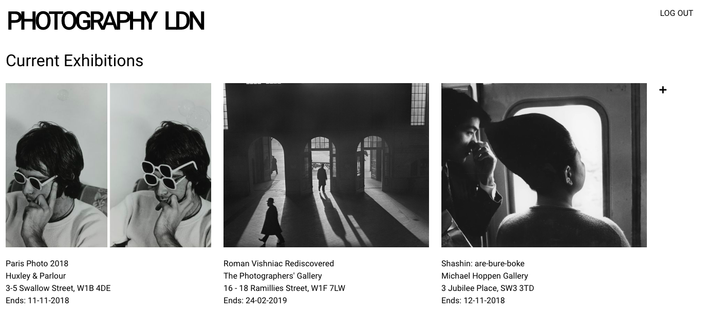

#   WDI Project Two: Photography LDN

## Brief
Design a full-stack Node app that meets the following technical requirements:

* Have at least 2 models – one representing a user and one that represents the main resource of your app.
* Include relationships - embedded or referenced.
* Have complete RESTful routes for at least one of your resources with all CRUD actions.
* Be deployed online and accessible to the public.
* Have semantically clean HTML
* The app should include authentication - with encrypted passwords & an authorisation flow.
* The app should be styled with Bulma.

**Timeframe**: 1 week

## Overview
A fully RESTful Express app showcasing upcoming photography exhibitions in London. The app allows users to register, login and logout, add, edit and delete exhibitions, and add and delete comments on exhibitions.

View on Heroku [here.](https://fierce-earth-26546.herokuapp.com/)

## Technologies Used

* HTML5
* CSS3
* JavaScript (ECMAScript 6)
* Git
* GitHub
* Node.js
* Express
* EJS
* MongoDB
* NodeJS

## Design

## Wins and Challenges

### Wins
To be completed

### Challenges
To be completed

## Future Features
* Make website mobile responsive
* Auto input username when leaving a review of an exhibition
* Limit ability to delete exhibitions and comments to user that created them
